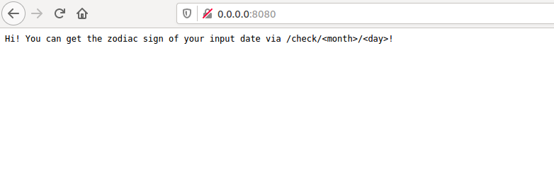
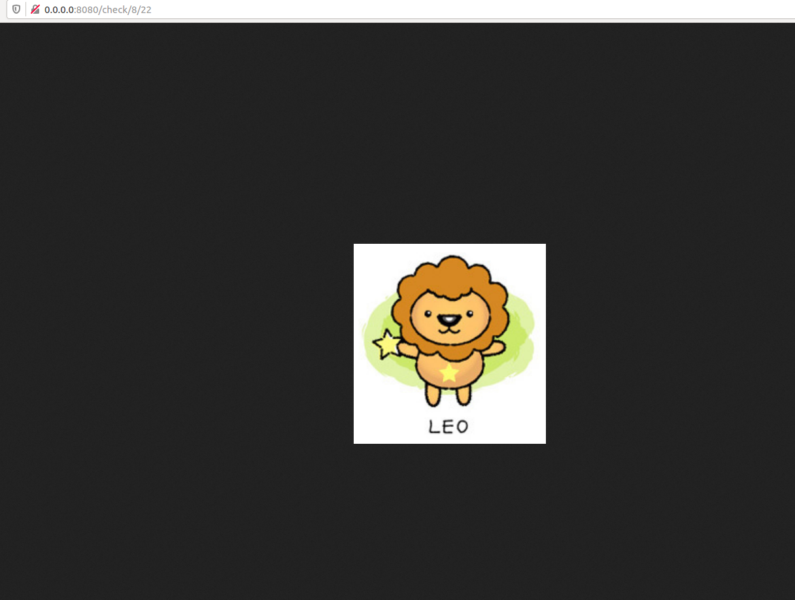

# Jinghuai Zhang-Microservice-Project2

## Key Objectives of Project
In project 2, our target is to build a Microservice in Rust. In particular, I create a program which takes a specific date as input to check the zodiac sign of this date. The program will return a cartoon image as output to illustrate the result.

## 1. Set up configurations.
* Create a Dockerfile.

* Create a Makefile.

* Set up the Cargo.toml to include the dependencies.

### 2. Test the project locally.
* To create a project environmentm type:

`cargo new ***`

* To compile the rust project, type:

`cargo build`

* To run the project, type:

`cargo run` 

* Usage of an example:

Url "0.0.0.0:8080" returns the root page: "Hi! You can get the zodiac sign of your input date via /check/<month>/<day>!"

Url "0.0.0.0:8080/check/<month>/<day>" returns a cartoon image of the corresponding zodiac sign for the input date (e.g., August 22 -> Leo) 

## 3. Deploy the project on the cloud.
