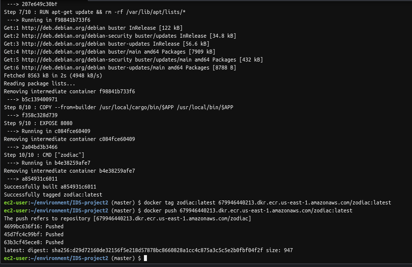

# Jinghuai Zhang-Microservice-Project2

## Key Objectives of Project
In project 2, our target is to build a Microservice in Rust. In particular, I create a program which takes a specific date as input to check the zodiac sign of this date. The program will return a cartoon image as output to illustrate the result.

## 1. Set up configurations.
* Create a Dockerfile.

* Create a Makefile.

* Set up the Cargo.toml to include the dependencies.

### 2. Test the project locally.
* To create a project environmentm type:

`cargo new ***`

* To compile the rust project, type:

`cargo build`

* To run the project, type:

`cargo run` 

* Usage of an example:

Url "0.0.0.0:8080" returns the root page: "Hi! You can get the zodiac sign of your input date via /check/<month>/<day>!"

Url "0.0.0.0:8080/check/<month>/<day>" returns a cartoon image of the corresponding zodiac sign for the input date (e.g., August 22 -> Leo)

## 3. Deploy the project on the cloud via AWS App Runner

* 1. Deploy the codebase on AWS Cloud9.

* 2. Create a private repository (e.g., zodiac) on AWS Amazon Elastic Container Registry.

* 3. Run each command behind the "View push commands" button of the created repository.

* 4. Create a new service in AWS App Runner.

* 5. Test the project on the cloud.

## 4. Deploy the project via Minikube

* Requirements: Install minikube and kubectl

* 1. Push the docker to the Dockerhub: https://hub.docker.com/r/jzhang538/project2 (Remember to run `sudo chmod 666 /var/run/docker.sock` when permission deny occurs)

* 2. `minikube start`

* 3. `dashboard --url`

* 4. Hover over link and "follow link"

* 5. Create a deployment: `kubectl create deployment project2 --image=registry.hub.docker.com/jzhang538/project2`

* 6. View deployment: `kubectl get deployments`

* 7. Create service and expose it: `kubectl expose deployment project2 --type=LoadBalancer --port=8088`

* 8. View services: `kubectl get service project2`

* 9. `minikube service project2 --url`

* 10. Curl web service

* 11. Cleanup

`kubectl delete service project2`
  
`kubectl delete deployment project2`
  
`minikube stop`

